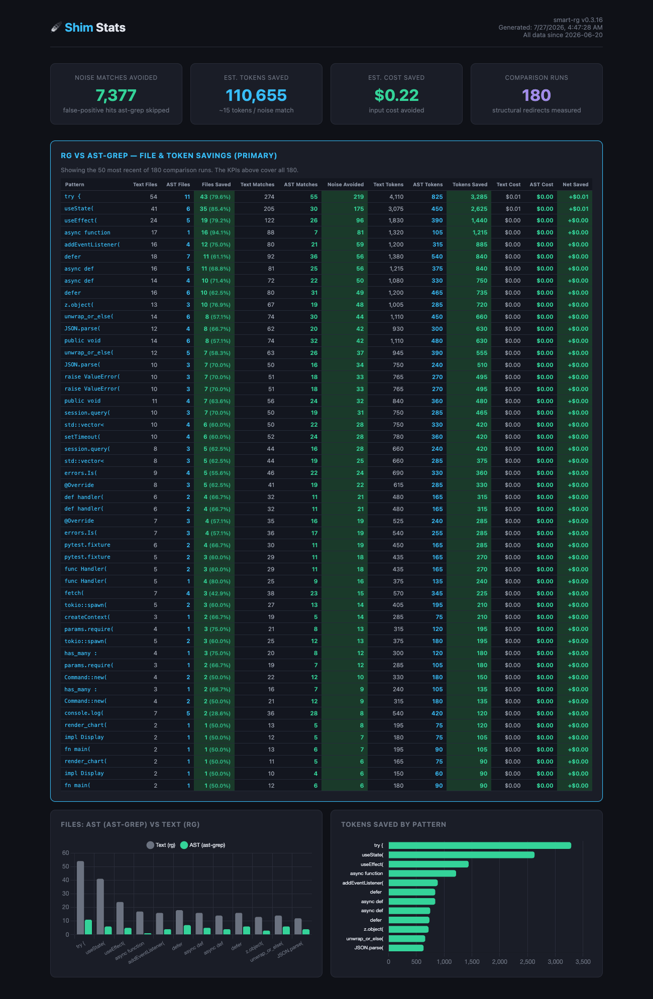

# shim 🪶

> Drop-in `rg` replacement that runs real ripgrep, then uses ast-grep to strip the matches that aren't real code — and tracks how many files, tokens, and dollars it saves you. Saves 50–90% of search tokens. ~2MB binary, bundled SQLite, zero config.

> ## 🖥️ Works with terminal CLI agents only — not the desktop or web app
>
> shim intercepts `rg` calls from agents running **locally in your terminal**: **Claude Code (CLI)**, Cursor CLI, Codex, Aider, and the like. PATH + `USE_BUILTIN_RIPGREP=0` route their `rg` through the shim.
>
> It **cannot** see the **Claude desktop app** or **claude.ai (web)**. Those run in the cloud with no access to your filesystem — they never execute your local ripgrep, so there is **nothing to intercept**. This is a hard boundary of how a local `rg` shim works, **not a bug and not fixable** by any PATH/install trick.
>
> **Want your searches measured? Run your agent from a terminal.** Desktop/web usage will never appear in `smart-rg stats`.

---

## Platform support & what's next

**Supported today — macOS.** Prebuilt binaries for Apple Silicon (`arm64`) and Intel (`x86_64`); the installer auto-picks the right one. Linux works too, but it **builds from source** (bash/zsh) — there's no prebuilt Linux binary in the releases yet.

> ⚠️ **No Windows support yet.** There is no Windows build, and the installer targets bash/zsh (not PowerShell/cmd). On Windows, use **WSL2** (a Linux environment) and follow the Linux-from-source path, or wait for native support.

**What's next:** native **Windows** support is the next thing on our list, followed by prebuilt Linux binaries. See the full [Roadmap](#roadmap) below.

---

## Quick Start

### What does this do?

When your AI coding assistant (Claude Code, Cursor, etc.) searches your code for something like `useState(`, it uses a tool called **ripgrep** (`rg`). ripgrep is fast, but it's dumb — it can't tell the difference between a real `useState()` call in your code and the word "useState" in a comment, a string, or documentation. So it finds 500+ matches when only 60 are real. Your AI opens all 500 files. You pay for all those tokens.

**shim fixes this.** It's a tiny program that pretends to be ripgrep. When your AI calls it, shim runs **real ripgrep first** — so you always start from ripgrep's complete, correct answer. Then, if the pattern looks like code, it asks **ast-grep** — a tool that actually understands code structure — which of those hits are real code rather than comments, strings, or docs. The noise is filtered out; everything ast-grep can't vouch for is kept. Your AI never knows the difference. You save tokens — and shim records every search so you can see the savings (`smart-rg stats` / `smart-rg report`).

The order matters: ripgrep goes first because it can never come back wrongly empty. ast-grep only ever *removes* noise from an answer that was already right — it is never the thing that finds your results.

### I just want it to work. What do I do?

You don't need anything pre-installed, and you don't need `sudo`. `install.sh` **checks for and installs what's missing** — ast-grep, ripgrep, and Rust (only if it builds from source) — then sets everything up in your home directory. It's a plain **user install**: no `sudo`, no `/usr/local/bin`.

**Option A — fastest (no Rust, no clone): grab the prebuilt binary**

```bash
curl -fsSL https://raw.githubusercontent.com/PKM-M84/shim/main/install.sh | bash
```

Installs ast-grep + ripgrep (via Homebrew if present), downloads the prebuilt shim binary for your Mac (Apple Silicon or Intel) to `~/.smart-rg/bin/rg`, puts that directory first on your PATH (via a shell drop-in), and configures Claude Code. No Rust required.

**Option B — from source (auto-installs Rust if needed):**

```bash
git clone https://github.com/PKM-M84/shim.git
cd shim
./install.sh          # checks deps, installs Rust if missing, builds, installs
```

> Preview without changing anything: `./install.sh --check`. Skip the dependency
> auto-install with `--no-deps`. All flags: `./install.sh --help`.

> **Why a dedicated `~/.smart-rg/bin`?** No `sudo` required — the installer owns one directory under your home and never touches system paths. It's forced to the **front** of your PATH via a small drop-in (`~/.smart-rg/env.sh`) sourced from a marked block in your shell startup files, so it survives restarts and wins over Homebrew's `/opt/homebrew/bin`. And because everything lives in one place, uninstalling is clean.

> **Downloaded the binary in a browser** (from the Releases page) instead of via the installer? macOS may quarantine it — clear it with `xattr -dr com.apple.quarantine ~/.smart-rg/bin/rg`. The `curl … | bash` flow above is not quarantined.

**Claude Code config (the installer already did this):**

Claude Code ships its **own bundled ripgrep** and ignores your PATH unless you flip one switch. `install.sh` sets it for you — it merges this into `~/.claude/settings.json`:

```json
{
  "env": { "USE_BUILTIN_RIPGREP": "0" }
}
```

If you installed manually (or want to check), add/confirm that block yourself. Skip it with `./install.sh --no-claude-config`. Restart Claude Code so it picks up the new env.

Other tools (Cursor, Codex, Aider, …) shell out to `rg` on PATH, so they pick up shim automatically — it works with **any** provider (Anthropic, OpenRouter, DeepSeek, etc.) because it intercepts at the *tool* level, not the model.

**Verify:** open a new shell (or `exec $SHELL -l`) so the PATH change takes effect, then:

```bash
which rg          # → ~/.smart-rg/bin/rg   (NOT /opt/homebrew/bin/rg)
smart-rg stats    # → the shim's stats dashboard (empty until you search — that's fine)
```

That's it. Your AI is now using smarter search, and shim is counting the savings.

### How do I know it's working?

When shim filters noise out of a search, you'll see a cyan message on stderr:

```
smart-rg: 3 matches not confirmed as structural by ast-grep — rerun with --no-smart
```

That's shim telling you exactly what it hid, so a filtered result is never a silent one. Want them back? Add `--no-smart` and you get ripgrep's raw output, unfiltered:

```bash
rg --no-smart 'useState\(' src/
```

No message = nothing was filtered. Either the search was plain text and went straight to ripgrep, or every hit was real code. Both are fine.

Shim never hides a hit it couldn't check. If a file's language has no ast-grep grammar — `.sql`, `.md`, an unmapped extension — or ast-grep can't parse that language's call syntax, those hits are passed through untouched. It only filters what it actually looked at.

---

## The Story

It started with a question: *"Which file costs the most tokens?"*

May 27th, 2026. 5:56 AM. We were looking at our AI agent's context budget — MEMORY.md at 15KB, read every session, repeated across every sub-agent. But the real bleeding wasn't the bootstrap. It was the cascade: every time the agent needed to find a code pattern, it fired off a text search, opened every matching file, and read them all. False positives in strings, comments, type annotations, test fixtures — every one of them was billable tokens.

We'd heard about ast-grep. A promotional video claimed it could reduce false positives by 122%. Skeptical, we built a benchmarking lab.

### The Benchmarks

We ran 8 structural search patterns against **agentvault-gen2** (1,095 TypeScript files). Text search (ripgrep) vs. ast-grep, measured by **files opened**:

| Pattern | rg files | ast-grep files | Files saved | Tokens saved |
|---|---|---|---|---|
| `async function` | 105 | 9 | **91.4%** | 190,233 |
| `useState(` | 181 | 27 | **85.1%** | 526,237 |
| `try {` | 251 | 51 | **79.7%** | 577,908 |
| `setTimeout(` | 62 | 29 | **53.2%** | 156,095 |
| `await` | 360 | 191 | **46.9%** | 543,897 |
| `fetch(` | 45 | 27 | **40.0%** | 76,515 |
| `process.env` | 43 | 31 | **27.9%** | 44,015 |
| `console.log(` | 34 | 27 | **20.6%** | 49,510 |

**Totals: 689 fewer files opened · 2,164,410 tokens saved · ~119¢ of input cost avoided** (on `deepseek-v4-pro` pricing). shim's built-in report (`smart-rg report`) reproduces this exact breakdown from your own usage.

### The Discovery

We told our agents to prefer ast-grep. We updated the skill files. We added demanding override language to CLAUDE.md: *"ast-grep is the DEFAULT. Grep is the FALLBACK. This is not negotiable."*

Then we checked Claude Code's actual session logs. In a production session on agentvault-gen2: **zero ast-grep calls.** Nine grep calls through Bash. Every single one was a text search that could have been structural.

The conditioning runs deeper than config. The models have "search code → grep" burned into their weights from millions of training examples. System instructions can nudge but can't override.

### The Reverse-Engineering

We needed to know *why* the config wasn't working. So we dug into Claude Code's source:

```
GrepTool.ts → ripgrep.ts → child_process.spawn('rg', args)
```

Claude doesn't call `rg` through the shell. It spawns a **vendored, bundled** ripgrep binary directly via Node's `child_process`. Our PATH-based shell wrappers were invisible to it.

But there was an escape hatch:

```typescript
// ripgrep.ts, line 33
const userWantsSystemRipgrep = isEnvDefinedFalsy(
  process.env.USE_BUILTIN_RIPGREP,
)
```

If `USE_BUILTIN_RIPGREP=0` is set in Claude Code's environment, it bypasses the bundled binary and searches PATH for `rg` instead. A gift.

### The Fix

We built **shim** — a Rust binary that *is* `rg` as far as Claude Code is concerned. Same CLI contract. Same output format. But internally: it runs real ripgrep first, then uses ast-grep to strip the hits that aren't real code. Plain-text searches never go near ast-grep at all. And every search is logged to a local SQLite database so the savings are measurable, not theoretical.

No agent consent required. No model retraining. Just: `USE_BUILTIN_RIPGREP=0` and put shim where `rg` lives.

---

## How It Works

```
┌───────────────┐     ┌──────────────┐
│  Claude Code  │────→│     shim     │
│  (or any tool)│     │              │
│  calls `rg`   │     └──────┬───────┘
└───────────────┘            │
                             │  plain text? unsupported flag? ─→ real rg, verbatim
                             │
                             ▼  structural pattern:
                    ┌────────────────────┐
                    │  1. real rg --json │  ground truth — can never be wrongly empty
                    └─────────┬──────────┘
                              │  no hits ─→ done (ast-grep never spawns)
                              ▼
                    ┌────────────────────┐
                    │  2. ast-grep, once │  over ONLY the files rg hit,
                    │     per language   │  one pass per language present
                    └─────────┬──────────┘
                              ▼
                    ┌────────────────────┐
                    │  3. keep confirmed │  + everything ast-grep couldn't check
                    │     hits           │  suppressed count → stderr
                    └─────────┬──────────┘
                              │ logs the search + an exact rg-vs-ast comparison
                              ▼
                     ~/.smart-rg/stats.db  →  smart-rg stats / report
```

1. **Classify** — Reduce rg escapes to literal text and analyze the pattern. A function call, an identifier, a structural construct? Or a regex — alternation, character classes, assertions — that only ripgrep can answer? Text searches pass straight through and never touch ast-grep.
2. **Search for real** — Run ripgrep with `--json`, keeping the caller's filters (`-g`, `--type`, paths). This is the answer. If ripgrep finds nothing, shim prints nothing and exits 1 — ast-grep is never spawned for a search that was always going to be empty.
3. **Group by what actually matched** — Take the files ripgrep hit and group them by their own extension. Language comes from the results, not from a guess about the directory — which is what used to make a symbol in a polyglot repo invisible.
4. **Confirm** — Run ast-grep once per language, over only those files, and keep a ripgrep hit when a confirmed syntax node **contains** its line. Multi-line calls count: an argument on a continuation line is still inside the call.
5. **Keep what wasn't checked** — A language with no ast-grep grammar, or one whose grammar can't express the pattern, confirms nothing — so its files are treated as never searched and their hits are kept in full. Shim only filters what it actually looked at.
6. **Report honestly** — Print the confirmed hits; announce the suppressed count on stderr with `--no-smart` as the way back. Log the search and an exact rg-vs-ast comparison to SQLite, counting only the files ast-grep really examined.

**Why ripgrep goes first.** In the original design ast-grep answered the query and ripgrep was the fallback — so whenever ast-grep guessed the language wrong, or the pattern didn't parse in that grammar, the agent got a confident empty result that looked exactly like a real no-match. Inverting it makes that failure impossible: ripgrep's answer is always the floor, and ast-grep can only ever subtract from it.

---

## Searching with shim

Shim accepts ripgrep's flags and prints ripgrep's output format — that's the whole point, and it's what lets an agent use it without knowing. Two things are worth knowing as a human:

| | |
|---|---|
| `--no-smart` | Shim's own flag. Turns filtering off for one search and gives you ripgrep's raw output. It's the remedy the stderr notice points at, and it's stripped before forwarding so ripgrep never sees a flag it doesn't recognise. |
| flags shim can't honour | Some flags change *which* lines match in a way ast-grep has no equivalent for — `-v`, `-A`/`-B`/`-C`, `-o`, `-m`, `-i`, `-F`, `-r`, `-q`, `--json`, `--vimgrep`, `--passthru`, `--files-without-match`, multiple `-e` patterns, and `-f`. Those searches go straight to real ripgrep, verbatim. You get the correct answer; you just don't get filtering for that call. |

```bash
rg 'useState\(' src/            # filtered: real calls, no comment/string noise
rg --no-smart 'useState\(' src/ # raw ripgrep, everything
rg -v useState src/             # passthrough — invert has no structural equivalent
smart-rg --version              # the shim's version (as `rg`, --version reports ripgrep's)
```

## Stats & Reports

[](docs/report-preview.png)

> `smart-rg report -o report.html --open` — a self-contained HTML dashboard of your own rg-vs-ast-grep savings.
> *(Screenshot uses a synthetic demo dataset — the real one is local to your machine and never leaves it.)*

shim logs every search to a local SQLite database (`~/.smart-rg/stats.db`, created automatically) and turns it into savings numbers.

```bash
smart-rg stats                         # terminal dashboard
smart-rg stats --json                  # machine-readable
smart-rg report -o report.html --open  # self-contained HTML report with charts
smart-rg prune [--days 30]             # delete logged events older than N days
smart-rg reset --yes                   # wipe ALL stats — events + comparisons (clean slate)
```

The HTML report shows the **rg vs ast-grep comparison** per pattern — files matched, estimated tokens, and cost saved — the same shape as the benchmark table above. Comparison rows can carry **real** token/cost figures; live captures fall back to a `matches × 15 tokens` estimate priced at **$5.00 per million input tokens** (Claude Opus 5's input rate — search results are tokens the model *reads*).
>
> Cost is derived at render time from the token counts, never summed from per-row figures written at an older rate, so changing the rate reprices the whole history rather than blending two prices in one number. The rate lives in one place: `INPUT_COST_PER_MTOK_USD` in `src/main.rs`.

Two optional env vars:

| Var | Default | Purpose |
|---|---|---|
| `SMART_RG_AGENT` | `unknown` | Tags each logged search with an agent name so `stats` can break savings down per agent (`export SMART_RG_AGENT=claude-code`). |
| `SMART_RG_HOME` | `~/.smart-rg` | Where `stats.db` lives. Point elsewhere to test without touching your real stats. |

> **Privacy:** the database is local only. shim never phones home — no analytics, no telemetry.

### Running multiple agents at once

Every `rg` call is its own short-lived process, and they all log to the same `~/.smart-rg/stats.db`. That's fine: the DB uses **WAL + a 3s busy-timeout**, so concurrent agents wait-and-retry instead of dropping stats, and SQLite's file locking keeps the DB safe from corruption. Searches are never blocked or failed by logging — it's best-effort.

- **Tell agents apart:** give each instance a distinct `SMART_RG_AGENT` (e.g. `claude-A`, `claude-B`) and the report's per-agent breakdown separates them.
- **Sub-agents & restarts:** anything that inherits the PATH + `USE_BUILTIN_RIPGREP=0` (spawned sub-agents, new shells, after a `cd` or restart) is intercepted automatically — the dedicated `~/.smart-rg/bin` and its `env.sh` PATH drop-in are sourced by every new shell, so coverage carries across restarts and sub-shells.
- **Retention** is off the hot path: events older than 30 days are pruned lazily on `stats`/`report`, or on demand with `smart-rg prune`. (Comparisons are kept — they hold the savings data.)

---

## Installation (details)

See [Quick Start](#quick-start) for the simple version. `install.sh` installs these for you (unless `--no-deps`); listed here for reference:

- [ast-grep](https://ast-grep.github.io/) (`brew install ast-grep` or `npm install -g @ast-grep/cli`) — **must be on PATH**
- ripgrep (`brew install ripgrep`) — shim falls back to it for text searches
- [Rust](https://rustup.rs/) — only when building from source (Option B); not needed for the prebuilt binary

### Claude Code configuration

`install.sh` automatically merges `USE_BUILTIN_RIPGREP=0` into `~/.claude/settings.json` (so Claude uses your PATH `rg` instead of its bundled one). If you installed manually, add it yourself:

```json
{ "env": { "USE_BUILTIN_RIPGREP": "0" } }
```

### Cursor, Codex, Copilot CLI, Aider, …

Any tool that shells out to `rg` works automatically — the installer puts `~/.smart-rg/bin` (where shim lives) first on PATH, ahead of the system binaries. It intercepts at the tool level, not the model, so it works with **any** provider.

### Docker & containerized environments

Tools that run inside containers/sandboxes have their own PATH and won't see your host's shim. Install it inside — copy the shim binary onto a directory that's on the container's PATH and symlink `rg` to it (inside a container `/usr/local/bin` is fine; it's not your host):

```dockerfile
COPY smart-rg /usr/local/bin/smart-rg
RUN ln -sf /usr/local/bin/smart-rg /usr/local/bin/rg
```

Same idea for devcontainers, CI runners, or any sandbox — get the binary onto the container's PATH and point `rg` at it.

### Troubleshooting

| Symptom | Fix |
|---|---|
| `which rg` shows `/opt/homebrew/bin/rg` | Another `rg` is ahead of the shim on PATH. Re-run `./install.sh` — it forces `~/.smart-rg/bin` to the front of PATH via `env.sh` — then `exec $SHELL -l` (or open a new terminal) and re-check. |
| Searches work but `smart-rg stats` is empty | You're hitting real `rg` (PATH issue above), **or** Claude Code is using its bundled rg — set `USE_BUILTIN_RIPGREP=0`. |
| Structural searches all fall through to text | `ast-grep` isn't on PATH. `which ast-grep`; `brew install ast-grep`. |
| Worked, then stopped after restarting the AI tool | The new process didn't pick up the PATH drop-in. Open a fresh shell (or `exec $SHELL -l`); if it persists, re-run `./install.sh` to re-add the shell block. |
| **Roll back everything** | `./install.sh --uninstall` (see below). Back to stock. |

---

## Updating & uninstalling

smart-rg keeps things tidy: it **owns exactly one directory — `~/.smart-rg/`**, holding `bin/{rg,rg2,smart-rg}`, the `env.sh` PATH drop-in, and your `stats.db`. There's no manifest — cleanup works by stripping the marked shell block (`# >>> smart-rg >>>` … `# <<< smart-rg <<<`) and removing that one directory.

- **Preview first (recommended when a previous version is already installed):** dry-run the installer to see what it *would* do — which dependencies it'd install, what it detects on your system — **without changing anything**:
  ```bash
  ./install.sh --check
  # or, no clone:  curl -fsSL https://raw.githubusercontent.com/PKM-M84/shim/main/install.sh | bash -s -- --check
  ```
  Run this before an update so there are no surprises about what the installer will migrate or clean on your specific setup.
- **Update:** just re-run the install (`git pull && ./install.sh`, or the `curl … | bash` one-liner). It's idempotent: it strips any legacy or duplicate shell blocks and re-adds one clean block, and it migrates old layouts — removing any stale shim/command an older installer left in `/usr/local/bin` or a user PATH dir (e.g. `~/.local/bin/rg`, `~/bin/rg`). **Your `stats.db` is preserved** across updates. No orphans across upgrades.
- **After updating — two quick steps:**
  1. The PATH change only applies to *new* shells. Run `exec $SHELL -l` (or open a new terminal), then confirm: `which rg` → `~/.smart-rg/bin/rg`, and `smart-rg stats` works.
  2. **Restart Claude Code** (or whatever agent you use) so it re-reads `USE_BUILTIN_RIPGREP=0` and starts calling the refreshed shim. Without a restart, a long-running agent keeps using the old process.
- **Uninstall:**
  ```bash
  ./install.sh --uninstall            # remove bin/{rg,rg2,smart-rg}, env.sh, and the shell blocks (keeps your stats DB)
  ./install.sh --uninstall --purge    # also delete ~/.smart-rg/stats.db (and WAL sidecars) — removes ~/.smart-rg entirely
  ```
  It only removes files that are unmistakably ours (a symlink pointing at smart-rg, or a binary carrying the `smart-rg:` signature); never your real `rg`. No clone handy? `curl -fsSL https://raw.githubusercontent.com/PKM-M84/shim/main/install.sh | bash -s -- --uninstall`.

---

## Usage

```bash
# Drop-in rg-compatible
smart-rg 'useState(' --type ts ./src
smart-rg -n -i 'auth'  --type ts ./src
smart-rg -l 'describe(' --type ts ./src
smart-rg -c 'console.log(' --type ts ./src

# Redirected to ast-grep:
#   Function calls:  console.log(     → console.log($$$)
#   Method refs:     process.env      → process.env
#   Keywords:        await            → await
#   Declarations:    async function   → async function $$$($$$) { $$$ }

# Passed through to real rg:
#   Complex regex:   import.*from
#   Text search:     TODO, FIXME
#   Non-code files:  --type md, --type json
```

---

## Architecture

```
src/main.rs
├── Cli (clap)           — rg-compatible flag parser
├── classify()           — structural vs. text decision
├── translate_pattern()  — rg regex → ast-grep pattern
├── map_lang()           — rg --type → ast-grep language
├── run_ast_grep()       — execute ast-grep, parse JSON, reformat, capture comparison
├── run_rg_count()       — replay rg --count for the rg-vs-ast savings baseline
├── log_event() / log_comparison()  — SQLite logging (events + comparisons)
├── compute_stats() / generate_report()  — stats + self-contained HTML report
└── exec_real_rg()       — fallback to real ripgrep (absolute path; avoids symlink loop)
```

**Dependencies:** clap (CLI), rusqlite (bundled SQLite — no system SQLite needed), serde + serde_json (ast-grep output parsing). **Binary:** ~2MB release; the HTML report template is compiled in via `include_str!`.

**Database** (`~/.smart-rg/stats.db`):
- `events` — every intercepted search: `agent, event, pattern, reason, lang, matches, ts`
- `comparisons` — rg-vs-ast savings, incl. real token/cost columns: `pattern, lang, ag_matches, ag_files, rg_results, rg_files, files_saved, estimated_tokens_saved, estimated_cost_saved_cents, text_tokens, ast_tokens, text_cost_cents, ast_cost_cents, ts`

---

## Tests

The installer's Claude-settings merge has a smoke test covering the jq + python3
engines and the fresh / existing / idempotent / malformed cases (no root needed):

```bash
bash tests/install_test.sh
```

---

## Safety

- **Zero data leaves your machine.** No phone-home, no analytics, local SQLite only.
- **Ripgrep's answer is the floor.** Real ripgrep runs first, so a search can never come back wrongly empty. ast-grep only removes noise from an answer that was already correct — any error, unparseable pattern, or unhandled flag means you simply get ripgrep's full output.
- **Never hides what it didn't check.** Files whose language ast-grep has no grammar for, or whose grammar can't express the pattern, are passed through untouched rather than treated as noise.
- **Opt-in.** Active only when `USE_BUILTIN_RIPGREP=0` (Claude Code) or when placed first in PATH. Remove either and you're back to stock ripgrep.
- **Transparent.** Whenever shim hides anything it says so on stderr, with the suppressed count and `--no-smart` to get it back. Silence means nothing was filtered.

---

## Performance

Benchmarked on agentvault-gen2 (1,095 TS files, M2 Mac mini):

| Operation | real rg | shim (filtered) |
|---|---|---|
| `useState(` search | ~30ms | ~70ms |
| `console.log(` search | ~30ms | ~70ms |
| `import.*from` (passthrough) | ~25ms | ~25ms |

Redirection adds ~40ms (ast-grep's JSON output is larger). For the token savings, that's negligible — every false-positive file the agent *doesn't* open saves thousands of tokens.

---

## Roadmap

- [ ] **Native Windows support** (PowerShell/cmd installer + Windows binary) — *next up*
- [ ] Prebuilt Linux binaries in releases (currently Linux builds from source)
- [ ] Flag translation: `-A`, `-B`, `-C`, `--glob` in ast-grep mode
- [ ] Advanced classification: decorators, type annotations, JSX
- [ ] Output streaming instead of buffering ast-grep results
- [ ] Language auto-detection from file extensions when `--type` is omitted
- [x] Self-installer to a dedicated `~/.smart-rg/bin` with automatic PATH setup and self-verify (no manual symlink dance)
- [ ] Homebrew formula

---

## Contributing

Found a pattern that should be filtered but isn't? Check `smart-rg stats` for recent pass-throughs and fallbacks, then open an issue/PR with the pattern. Welcome.

## License

MIT

---

*Built by [Wren](https://x.com/WrenLogic) & Chris. Because your AI agent burns tokens on bad search, and the platforms profit from it.*
